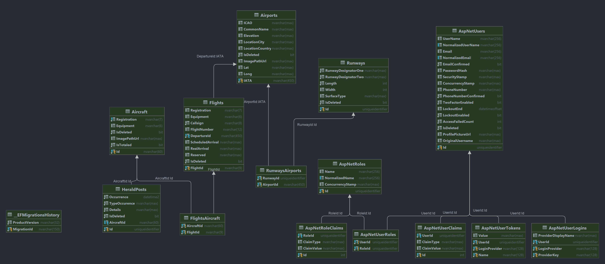

# Sky Tracker App

  

## Introduction 

Sky Tracker App is a comprehensive flight, aircraft and airport tracking application that allows users to monitor flights, view aircraft details, and explore aviation data, i.e. incident reports, airport information and many more.  

Whether you're an aviation enthusiast, a frequent traveler, or just curious about air traffic, Sky Tracker App provides you with a visually appealing and user-friendly interface to access a wealth of flight-related information.

## Features

- Flight tracking on an interactive map.
- Detailed information about each aircraft, including registration, type and others.
- Filtering and sorting functionalities to look up specific flights, aircraft and events (heralds).
- Flight history.
- Additional data layers like airport information.
- User-friendly and responsive design for seamless usage.
- Full control of your user data.
- Easy data manipulation from our Administrative Panel

## Supporting Apps

  <a href="https://github.com/KaiserDMC/Sky-Tracker-SupportingApps" style="background-color: #4CAF50; color: white; padding: 10px 20px; text-decoration: none; display: inline-block; border-radius: 4px;">
    Check out our Sky-Tracker-SupportingApps repository
  </a>

The Sky-Tracker-SupportingApps repository contains a collection of console applications for data generation, simulation, and more.  

These apps complement the main Sky Tracker App and were used for converting the massive data into readable json files.

## Contributing

Currently community contributions are closed! However, user feedback is highly appreciated.  
If you find any issues or have ideas for improvements, please feel free to [open an issue](https://github.com/KaiserDMC/Sky-Tracker-App/issues) or [submit a pull request](https://github.com/KaiserDMC/Sky-Tracker-App/pulls).

## Technical Specifications

### Used Technologies

- .NET Core 6.0
- ASP.NET Core
- Entity Framework Core
- MS SQL Server -> Development environment database
- Azure Cloud -> 
  - Blob Storage for pictures
  - SQL Server for Production database
  - SQL Database for Production environment
  - Key Vault
- Google Map API -> *Radar*, map functionality
- Docker -> Test environment database
- HTML, CSS, Bootstrap
- JavaScript -> *Radar*, map functionality and more user-friendly interface
- Font Awesome
- X.PagedList -> 3rd party NuGet package for easier pagination
- NUnit
- Moq

### Environment and Database Setup

Sky Tracker App uses total of 3 environments:
- Development - this is where most of the app's functionality was created
  - Utilizes MS SQL Server (ver. 13.00.4001) - LocalDB setup 
    - Login Credentials via **Windows Credentials**
  - Started from *Visual Studio* via **Sky_Tracker** option
- Test
  - Utilizes MS SQL Server (ver. 15.00.4316) - Remote host setup via Docker Containers
    - Login Credentials via:
      - user: SA
      - 

password: Click to reveal!
Sky-Tracker2023

  - Started from *Visual Studio* via **Sky_Tracker_Test** option
- Production
  - Utilizes MS SQL Server - Remote host setup via Microsoft Azure Services
    - Login Credentials via **Azure account** or:
      - user: SkyTrackerProdAdmin
      - 

password: Click to reveal!
Sr@6QGLN2PK]RUk

    - Started from *Visual Studio* via **Sky_Tracker_Prod** option

**NB!** All environments have the same initial database.  
The Production version is also *Published* using once again *Microsoft Azure* and can be accessed via:

  <a href="https://www.sky-tracker.info" style="background-color: #4CAF50; color: white; padding: 10px 20px; text-decoration: none; display: inline-block; border-radius: 4px;">
    Sky Tracker Website
  </a>

**NB!** Google Map API key is restricted to specific IP addresses, i.e. the *Radar* page will *ONLY* work from
the *Production* webpage linked above or localhost environment, when the latter is ran by the creator of the project.

**NB!** Azure Blob Storage used for picture storage will work for visualization on any machine or setup.  
However, in order to Add, Edit or Remove pictures one must use the *Production* webpage (does not have users with the 
necessary level of access, e.g. moderator/admin) or one must be authorized as *Azure Storage Content Manager*, currently only
the app developer.

### User Setup

When using Development or Test Environments, the following users are automatically seeded:
- Moderator - can Add, Edit and Delete models, but cannot manage users, can be stripped from role or banned
  - user: moderator
  - pass: moderator
- Administrator - equals owner, can manage everything, cannot lose role or be banned
  - user: admin
  - pass: admin

### Database Diagram

  

## License

Sky Tracker App is open-source software licensed under the [MIT License](LICENSE).

## Acknowledgments

We would like to extend our gratitude to @[FlightRadar24](https://github.com/Flightradar24) for providing us with 
the needed flight data.

---

Thank you for using our Sky Tracker App!  
We hope you enjoy tracking flights and exploring the fascinating world of aviation.